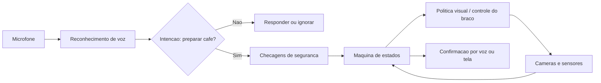

# Cortex Cafe - Braço Robótico por Voz

## Objetivo

Construir um assistente chamado **Cortex** que, ao ouvir o comando "Cortex, um cafe por favor", opere uma maquina Nespresso com o braco SO-101 e prepare uma dose de cafe de forma supervisionada.

## Escopo da primeira versao

O sistema deve executar uma receita fixa, em uma bancada sempre organizada da mesma forma:

1. Ligar a maquina, se ela estiver desligada.
2. Abrir o compartimento da capsula.
3. Pegar uma xicara e posiciona-la na base da maquina.
4. Pegar uma capsula e inseri-la no compartimento.
5. Fechar o compartimento.
6. Pressionar o botao de preparo.
7. Aguardar o fim da extracao e avisar que o cafe esta pronto.

Nao incluir, na primeira versao, limpeza automatica, troca de capsulas usadas, reabastecimento de agua, diferentes tamanhos de bebida ou manuseio de liquido quente.

## Principio de arquitetura

O comando de voz **nao deve controlar os motores diretamente**. Ele apenas solicita a receita; um controlador supervisionado valida as condicoes de seguranca e chama uma sequencia de subetapas.



## Seguranca obrigatoria

Antes de qualquer treino autonomo, implemente estas regras:

- Mantenha um botao de emergencia fisico e uma forma clara de cortar a alimentacao dos servos.
- Delimite uma area sem pessoas, animais, cabos soltos e objetos frageis durante o movimento.
- Use uma bandeja, xicara resistente e uma base antiderrapante.
- Nunca posicione a mao dentro da area de movimento enquanto o follower estiver energizado.
- Nao permita que o braco toque na saida de cafe, na agua quente ou na xicara apos iniciar a extracao.
- O braco nao deve operar a maquina sem agua, com recipiente ausente ou com capsula ja usada no compartimento.
- Limite velocidade, aceleracao e alcance do SO-101; teste cada movimento inicialmente sem capsula, sem xicara e com a maquina desligada.
- Exija confirmacao humana antes de pressionar o botao de preparo nas primeiras versoes.

## Preparar a bancada

O aprendizado por imitacao funciona melhor quando o ambiente e repetivel.

1. Fixar a maquina Nespresso na mesma posicao, marcada na bancada.
2. Fixar uma bandeja para xicaras e outra para capsulas, ambas dentro do alcance seguro do follower.
3. Marcar posicoes de repouso: `home`, xicara, capsula, alavanca e botao.
4. Usar sempre o mesmo modelo de xicara na fase inicial.
5. Ajustar as tres cameras para cobrir: visao ampla, garra/xicara e compartimento/botao.
6. Reduzir reflexos e manter iluminacao constante.
7. Calibrar o leader e follower antes de cada sessao e conferir portas e cameras.

## Dividir a tarefa em habilidades

Nao treine a receita inteira como um unico episodio no inicio. Colete e valide cada habilidade separadamente:

| ID | Habilidade | Inicio | Criterio de sucesso |
|---|---|---|---|
| H1 | Abrir compartimento | maquina pronta | alavanca totalmente aberta |
| H2 | Posicionar xicara | xicara na bandeja | xicara centrada na base |
| H3 | Inserir capsula | compartimento aberto | capsula assentada corretamente |
| H4 | Fechar compartimento | capsula inserida | alavanca totalmente fechada |
| H5 | Pressionar botao | xicara presente e maquina pronta | botao acionado sem colisao |

Somente depois que cada habilidade for consistente, grave episodios completos `H1 -> H5`.

## Coletar demonstracoes

### 1. Criar datasets separados

Use um dataset por habilidade, para evitar misturar estados e facilitar correcao de falhas:

| Habilidade | Dataset sugerido |
|---|---|
| H1 | `ilustraviz/cortex-cafe-abrir` |
| H2 | `ilustraviz/cortex-cafe-xicara` |
| H3 | `ilustraviz/cortex-cafe-capsula` |
| H4 | `ilustraviz/cortex-cafe-fechar` |
| H5 | `ilustraviz/cortex-cafe-botao` |
| Receita completa | `ilustraviz/cortex-cafe-completo` |

### 2. Gravar com o leader

Para cada habilidade:

1. Monte o estado inicial exatamente igual em todas as repeticoes.
2. Grave demonstracoes lentas, suaves e sem correcao brusca.
3. Use a seta `->` para salvar uma boa demonstracao.
4. Use a seta `<-` para descartar uma demonstracao ruim e grava-la novamente.
5. Registre diferentes posicoes pequenas de xicara/capsula, mas nao altere a organizacao geral da bancada.
6. Revise os videos antes do treino e descarte episodios com oclusao, colisao, capsula caida ou xicara mal posicionada.

Meta inicial: 30 a 50 demonstracoes limpas por habilidade. Para a receita completa, comece com pelo menos 50 demonstracoes bem-sucedidas e aumente a variedade gradualmente.

### 3. Comando base de gravacao

Use o comando de [PASSO_A_PASSO.md](PASSO_A_PASSO.md), trocando apenas `--dataset.repo_id` e `--dataset.single_task`. Exemplo para H2:

```bash
lerobot-record \
    --robot.type=so101_follower \
    --robot.port=/dev/ttyACM1 \
    --robot.id=my_awesome_follower_arm \
    --robot.cameras='{"camera1": {"type": "opencv", "index_or_path": "/dev/video2", "width": 640, "height": 480, "fps": 30, "fourcc": "MJPG"}, "camera2": {"type": "opencv", "index_or_path": "/dev/video0", "width": 640, "height": 480, "fps": 30, "fourcc": "MJPG"}, "camera3": {"type": "opencv", "index_or_path": "/dev/video4", "width": 640, "height": 480, "fps": 30, "fourcc": "MJPG"}}' \
    --teleop.type=so101_leader \
    --teleop.port=/dev/ttyACM0 \
    --teleop.id=my_awesome_leader_arm \
    --display_data=true \
    --display_ip=127.0.0.1 \
    --display_port=9877 \
    --dataset.repo_id=ilustraviz/cortex-cafe-xicara \
    --dataset.num_episodes=30 \
    --dataset.single_task="posicionar xicara na base da Nespresso"
```

## Treinar e avaliar

1. Treine inicialmente uma politica ACT por habilidade.
2. Execute primeiro com maquina desligada e sem itens frageis.
3. Avalie 20 tentativas por habilidade e registre sucesso, falha e causa.
4. Defina como meta minima 18 sucessos em 20 tentativas consecutivas antes de integrar a proxima habilidade.
5. Use DAgger somente depois de a politica realizar movimentos previsiveis; o operador corrige com o leader quando necessario.
6. Integre duas habilidades por vez: `H1 + H3`, depois `H2 + H5`, e por ultimo a receita completa.

## Implementar o comando de voz

### Fase 1 - Prototipo supervisionado

1. Instalar um microfone USB proximo a bancada.
2. Escolher reconhecimento local de voz em portugues, como Whisper ou Vosk.
3. Detectar a frase de ativacao: `Cortex`.
4. Aceitar somente uma intencao inicial: `um cafe por favor`.
5. Antes de mover o braco, responder: "Posso preparar o cafe?" e exigir confirmacao: "sim".
6. Quando confirmado, iniciar a maquina de estados no modo supervisionado.
7. Anunciar cada etapa e permitir cancelamento por `Cortex, parar`.

### Fase 2 - Integracao com o robô

Crie um pequeno servico Python separado do LeRobot com estes estados:

```text
IDLE
-> CONFIRMAR_PEDIDO
-> CHECAR_BANCADA
-> ABRIR_COMPARTIMENTO
-> POSICIONAR_XICARA
-> INSERIR_CAPSULA
-> FECHAR_COMPARTIMENTO
-> AGUARDAR_CONFIRMACAO_FINAL
-> PRESSIONAR_BOTAO
-> AGUARDAR_EXTRACAO
-> CONCLUIDO
```

Cada estado deve ter:

- uma pre-condicao observavel pelas cameras ou por confirmacao humana;
- limite de tempo;
- criterio de sucesso;
- transicao para falha segura, que para o braco e pede ajuda;
- registro em log para diagnosticar falhas.

## Criterios para considerar o projeto pronto

- O comando de voz e reconhecido corretamente em ambiente normal de cozinha.
- O sistema nunca inicia movimento sem confirmacao na fase supervisionada.
- Cada habilidade atinge pelo menos 90% de sucesso em 20 tentativas controladas.
- A receita completa funciona em pelo menos 15 de 20 tentativas, sem colisao, derramamento ou contato com partes quentes.
- O cancelamento por voz e o botao de emergencia interrompem a tarefa de forma previsivel.

## Proximo passo recomendado

Antes de treinar uma politica geral, prepare a bancada e grave apenas H2: pegar a xicara e posiciona-la na base. Essa etapa e a mais segura para validar alcance, garra, cameras e qualidade das demonstracoes sem operar a maquina quente.